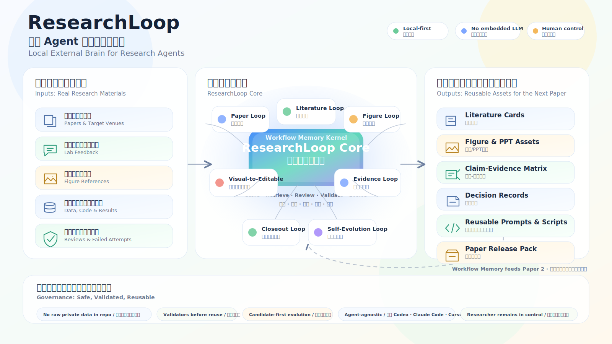
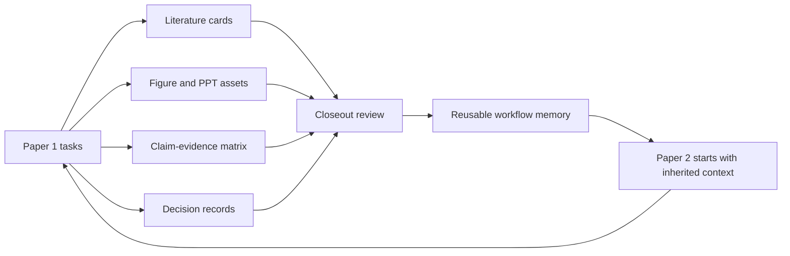

# ResearchLoop

**Turn every research task into a workflow your next paper can reuse.**



[中文 README](README.zh-CN.md)

ResearchLoop 不是通用知识库，也不是另一个 AI agent。每个科研项目都不一样，所以这个仓库不承诺提供一套固定、通用、开箱即用的科学工作流。

它做的是更窄也更耐用的事：在真实科研发生的过程中，帮助你稳定、验证、复用并迭代自己的研究工作流。

当你完成一次文献任务，它可以沉淀为 literature intake card。当你做了一页组会 slide，它可以沉淀为 figure 或 PPT asset。当你决定一个 claim、baseline、metric 或 limitation，它可以进入 claim-evidence matrix 和 decision record。当 Codex、Claude Code、Cursor 或其他 agent 完成一个研究任务，ResearchLoop 给 closeout 步骤一个地方，把有用经验写回 workflow memory。

ResearchLoop 是 Codex、Claude Code、Cursor 和类似 coding agent 的本地外置大脑。它不替代这些 agent，不内置 LLM，也不要求额外的模型 API key。它负责存储、检索、审查、验证和演化 reusable knowledge、reusable prompts、research and figure assets、decision records、paper workflows、claim-evidence links 和 feedback loops。

---

ResearchLoop is not a generic knowledge base, and it is not another AI agent. Every research project is different, so this repository does not promise a fixed, universal, ready-made scientific workflow.

It does something narrower and more durable: it helps you stabilize, validate, reuse, and iterate your own research workflow while real research is happening.

When you finish a literature task, it can become a literature intake card. When you make a lab-meeting slide, it can become a figure or PPT asset. When you decide a claim, baseline, metric, or limitation, it can become a claim-evidence matrix row and a decision record. When Codex, Claude Code, Cursor, or another agent finishes a research task, ResearchLoop gives the closeout step a place to write useful experience back into a workflow memory.

ResearchLoop is a local external brain for Codex, Claude Code, Cursor, and similar coding agents. It does not replace those agents, does not embed an LLM, and does not require an extra model API key. It stores, retrieves, reviews, validates, and evolves reusable knowledge, reusable prompts, research and figure assets, decision records, paper workflows, claim-evidence links, and feedback loops.

## Core Idea

The first paper is not the finish line. It is the point where your research workflow has finished its first initialization pass.

After one small paper, you should not only have a manuscript. You should also know which fields and venues to track, how papers enter your evidence chain, which figures are reusable, what every claim needs for support, and which prompts, scripts, templates, figure styles, and decisions can serve the second and third papers.

ResearchLoop does not train AI to do research for you. It helps you train a workflow around your own research topic.

## Loop Map

[Paper Loop](workflows/paper_driven/paper_loop.md) · [Literature Loop](workflows/paper_driven/literature_intake.md) · [Figure Loop](workflows/paper_driven/figure_intake.md) · [Visual-To-Editable Loop](workflows/visual_to_editable/README.md) · [Evidence Loop](templates/research_project/03_claim_evidence_matrix.yaml) · [Closeout Loop](workflows/paper_driven/experiment_closeout.md) · [Self-Evolution Loop](workflows/self_evolution_loop/README.md)

| Loop | What it captures | Current support |
|---|---|---|
| Paper Loop | research brief, target-paper distillation, gap/contribution, manuscript storyboard, release pack | Workflow, templates, minimal example, validator |
| Literature Loop | literature cards, evidence use, citation locations, limitations | Workflow, card template, registry, placeholder example |
| Figure Loop | visual references, figure cards, figure registry, rights/release notes | Workflow, card template, registry, internal examples |
| Visual-To-Editable Loop | image/screenshot/PDF/chart/table/flowchart/formula/UI inputs routed to editable PPT/SVG/HTML/Mermaid/Figma-style assets | Router rules, CLI validation, templates, sanitized example |
| Evidence Loop | claim-evidence matrix, data/code links, baselines, limitations | Template and validator-backed example |
| Closeout Loop | reusable knowledge, prompts, assets, decisions, registry updates | Workflow plus `closeout_check.py` |
| Self-Evolution Loop | recall, intake, candidate writeback, validation, next bottleneck | Local CLI with tests; promotion remains human-controlled |

## Who It Is For

- Graduate students writing a first SCI-style paper while literature, data, slides, code, figures, and manuscript notes feel scattered.
- Researchers already using Codex, Claude Code, Cursor, or similar agents, but missing durable project memory and review discipline.
- People who want lab-meeting feedback, reviewer comments, failed experiments, good figure references, and useful prompts to become reusable assets.
- Individual researchers who want each paper to inherit lessons from the previous one instead of restarting from scratch.

## What It Is Not

- Not a universal research workflow that fits every field.
- Not a system that writes papers for you, replaces a supervisor, or judges scientific claims by itself.
- Not an embedded LLM product and not an extra API layer.
- Not a place for raw experimental data, private traces, large images, model weights, PDFs, or submission packages.
- Not a promise that templates are mature production workflows. Templates and examples are labeled as templates and examples.

## Capability Status

| Capability | Evidence in this repository | Status |
|---|---|---|
| Paper-driven workflow | [`workflows/paper_driven/paper_loop.md`](workflows/paper_driven/paper_loop.md), [`templates/research_project/`](templates/research_project/), [`examples/paper_lifecycle_minimal/`](examples/paper_lifecycle_minimal/) | Usable scaffold |
| Literature intake / literature card | [`workflows/paper_driven/literature_intake.md`](workflows/paper_driven/literature_intake.md), [`templates/literature_card.md`](templates/literature_card.md), [`registry/literature.yaml`](registry/literature.yaml) | Template plus placeholder example |
| Figure intake / figure registry | [`workflows/paper_driven/figure_intake.md`](workflows/paper_driven/figure_intake.md), [`templates/figure_card.md`](templates/figure_card.md), [`registry/figures.yaml`](registry/figures.yaml), [`visual_refs/`](visual_refs/) | Template plus internal examples |
| Visual-to-editable router | [`workflows/visual_to_editable/`](workflows/visual_to_editable/), [`scripts/visual_to_editable_router.py`](scripts/visual_to_editable_router.py), [`registry/visual_to_editable_skills.yaml`](registry/visual_to_editable_skills.yaml), [`examples/visual_to_editable_minimal/`](examples/visual_to_editable_minimal/) | Spec plus local validator; external tools remain candidates |
| Claim-evidence matrix | [`templates/research_project/03_claim_evidence_matrix.yaml`](templates/research_project/03_claim_evidence_matrix.yaml), [`examples/paper_lifecycle_minimal/03_claim_evidence_matrix.yaml`](examples/paper_lifecycle_minimal/03_claim_evidence_matrix.yaml) | Template and minimal example |
| Reviewer gate | [`workflows/paper_driven/reviewer_gate.md`](workflows/paper_driven/reviewer_gate.md) | Manual checklist gate |
| Task closeout | [`workflows/paper_driven/experiment_closeout.md`](workflows/paper_driven/experiment_closeout.md), [`scripts/closeout_check.py`](scripts/closeout_check.py) | Working governance check |
| Self-evolution loop | [`workflows/self_evolution_loop/README.md`](workflows/self_evolution_loop/README.md), [`scripts/self_evolution_loop.py`](scripts/self_evolution_loop.py), [`tests/test_self_evolution_loop.py`](tests/test_self_evolution_loop.py) | Working local CLI, candidate-first |
| Reusable registries | [`registry/knowledge.yaml`](registry/knowledge.yaml), [`registry/prompts.yaml`](registry/prompts.yaml), [`registry/research_assets.yaml`](registry/research_assets.yaml), [`registry/decisions.yaml`](registry/decisions.yaml) | YAML registries with validators |
| Agent external brain positioning | [`AGENTS.md`](AGENTS.md), [`CLAUDE.md`](CLAUDE.md), [`mcp/README.md`](mcp/README.md) | Local integration guidance |
| Publication safety | [`.gitignore`](.gitignore), [`harness.yaml`](harness.yaml), closeout and registry validators | Guardrails plus manual review |

## Starter Workflow Integrations

ResearchLoop can offer optional starter workflows from upstream open-source
projects. These are not vendored into the repository. The first agent
interaction should check installer status and ask before downloading anything.

| Upstream project | Starter use | Local path | Install behavior | Status | License | Pinned ref |
|---|---|---|---|---|---|---|
| [Yuan1z0825/nature-skills](https://github.com/Yuan1z0825/nature-skills) | Optional seed workflows for literature search, paper reading, writing, reviewer simulation, citation checks, figures, paper-to-PPT, revision response, and related research-agent tasks | `external\nature-skills` | Ask once, then clone only after consent; no dependency install or global skill install | Optional starter, pending validation | Apache-2.0 | `8990143c3835f899e5331286a6a3b3393a2926ef` |

The machine-readable source of truth is
[`registry/upstream_workflows.yaml`](registry/upstream_workflows.yaml). Use one
README row per upstream project; keep detailed per-skill descriptions upstream
or in dedicated registry/docs entries.

## From Paper 1 To Paper 2



## First Use Path

1. Put the repository at a stable local path such as `D:\ResearchLoop`.
2. Read [`AGENTS.md`](AGENTS.md) and, if using Claude Code, [`CLAUDE.md`](CLAUDE.md).
3. On first agent interaction, check optional starter workflow status and ask before downloading Nature Skills.
4. Start a paper with [`templates/paper_contract.md`](templates/paper_contract.md) or the files in [`templates/research_project/`](templates/research_project/).
5. Turn real sources into [`templates/literature_card.md`](templates/literature_card.md), and register them in [`registry/literature.yaml`](registry/literature.yaml).
6. Turn useful visuals into [`templates/figure_card.md`](templates/figure_card.md), and register them in [`registry/figures.yaml`](registry/figures.yaml).
7. When a flat visual needs editable assets, classify it with [`scripts/visual_to_editable_router.py`](scripts/visual_to_editable_router.py), then keep the reconstruction prompt, manifest, QA, and reproduction note.
8. Bind claims to evidence with [`templates/research_project/03_claim_evidence_matrix.yaml`](templates/research_project/03_claim_evidence_matrix.yaml).
9. End each task with the closeout rules in [`workflows/paper_driven/experiment_closeout.md`](workflows/paper_driven/experiment_closeout.md).
10. Run validators before publishing or relying on the registry state.

## Commands

PowerShell examples:

```powershell
Set-Location G:\BaiduSyncdisk\ResearchLoop

python scripts\registry_tool.py validate
python scripts\validate_research_project.py --project-root examples\paper_lifecycle_minimal --json
python scripts\validate_asset_evolution.py --registry registry\asset_evolution.yaml --json
python scripts\evaluator.py evaluate --target all --json
python scripts\closeout_check.py

python scripts\visual_to_editable_router.py classify --request examples\visual_to_editable_minimal\request.yaml --json
python scripts\visual_to_editable_router.py validate-case --case-dir examples\visual_to_editable_minimal --json

python scripts\starter_workflow_installer.py status --id nature-skills --json
python scripts\starter_workflow_installer.py install --id nature-skills --json

python scripts\self_evolution_loop.py recall --query "paper closeout reusable workflow" --project-root G:\BaiduSyncdisk\ResearchLoop --json
python scripts\self_evolution_loop.py run --intake <intake.yaml> --apply-candidates --json
```

Optional local MCP read surface:

```powershell
python mcp\research_harness_mcp.py --self-test
```

The MCP file name keeps the historical `research_harness` identifier for compatibility; the project brand is ResearchLoop.

## Publication Safety

Commit only project templates, scripts, documentation, examples, registry schemas/cards, and blank or sanitized example files.

Do not commit:

- `.env`, API keys, credentials, local tokens, or personal path snapshots;
- raw data, original experiment logs, private traces, `runs/`, or `state/`;
- PDFs, large images, slide exports, final paper figures, manuscript packages, or submission files;
- model weights, checkpoints, binary arrays, large outputs, or temporary artifacts;
- `research_assets/` binaries beyond small Markdown manifests and reproduction notes.

ResearchLoop should point to sensitive or large material through explicit, local-only references when needed. It should not copy that material into the repository.

Visual-to-editable reconstruction follows the same rule: keep source screenshots,
PDFs, private figures, final figures, generated PPTX files, and tool traces
outside the repository. Commit only prompts, manifests, QA summaries,
reproduction notes, registry entries, and sanitized text examples.
