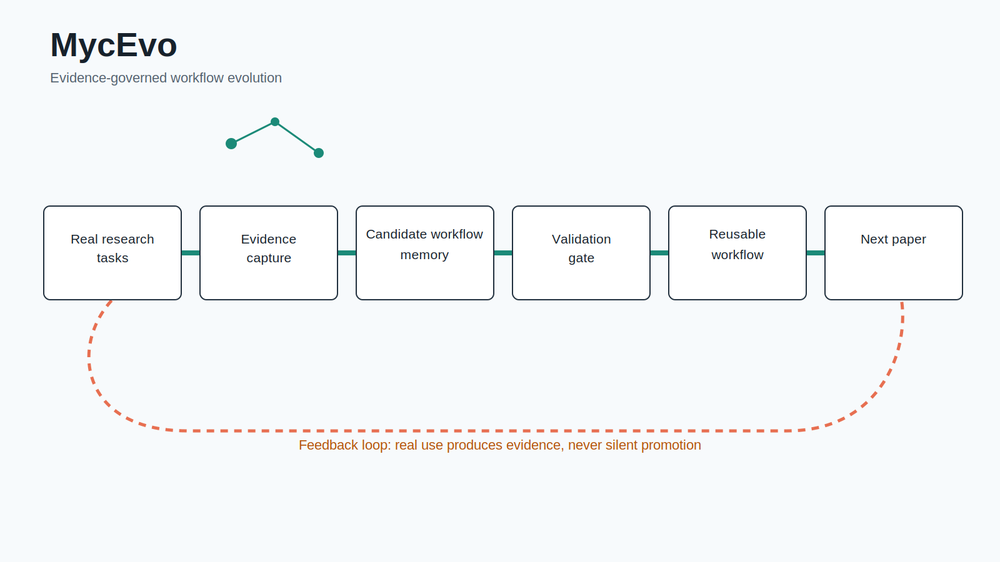
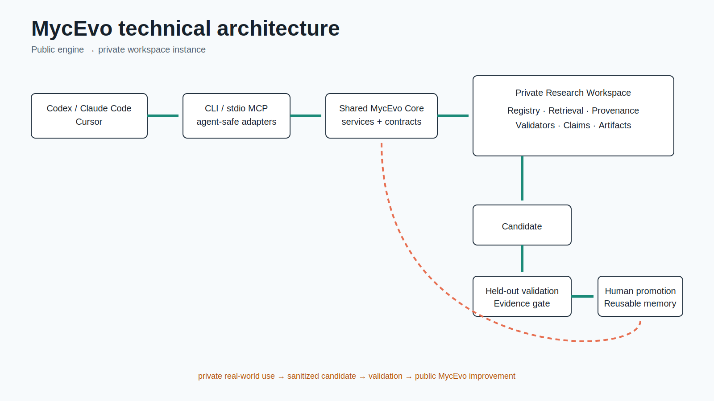

# MycEvo

[](pyproject.toml)
[](https://github.com/myc0576/MycEvo/actions/workflows/ci.yml)


**Evidence-Governed Self-Evolving Research Workflow Harness**

Turn every research task into evidence, and every validated lesson into a better workflow.

> **MycEvo does not do research for you. It makes your research workflow improve with use.**

[中文 README](README.zh-CN.md)

## Install

```bash
git clone https://github.com/myc0576/MycEvo.git
cd MycEvo
python -m pip install -e .
```

Wheel, pipx, and Git installs are also supported:

```bash
python -m build
python -m pip install dist/*.whl
pipx install .
python -m pip install git+https://github.com/myc0576/MycEvo.git
```

## 60-second quick start

Run these commands inside a new or existing research workspace:

```bash
mycevo init
mycevo demo
mycevo doctor
mycevo mcp install codex --workspace . --dry-run
# or: mycevo mcp install claude --workspace . --dry-run
```

`mycevo init` creates `.mycevo/`, registries, templates, a sanitized demo paper, and controlled agent guidance. `mycevo demo` runs a deterministic local loop:

```text
task -> intake -> candidate writeback -> validation -> closeout -> recall
```

Automatic writeback stops at `candidate` or `pending validation`. Human or evidence gates control `validated`, `reusable`, `approved`, and `paper_ready` states.

Use `--json` for stable machine output. The deprecated `resevo` and `researchloop` commands forward to `mycevo` with a migration warning.

## CLI and MCP

```bash
mycevo status
mycevo recall --query "validated figure workflow" --project-root .
mycevo closeout
mycevo mcp self-test
mycevo mcp install codex --workspace .
mycevo mcp status codex
```

MycEvo uses each agent's official `mcp add/get/remove` command. The stdio launch is bound to explicit `MYCEVO_ENGINE_ROOT` and `MYCEVO_ROOT` values. It does not edit guessed config formats, store keys, embed an LLM, or require another model API.

## Product architecture

<picture>
  <source media="(prefers-color-scheme: dark)" srcset="assets/readme/mycevo-product-dark.svg">
  <source media="(prefers-color-scheme: light)" srcset="assets/readme/mycevo-product-light.svg">
  
</picture>

## Technical architecture

<picture>
  <source media="(prefers-color-scheme: dark)" srcset="assets/readme/mycevo-technical-dark.svg">
  <source media="(prefers-color-scheme: light)" srcset="assets/readme/mycevo-technical-light.svg">
  
</picture>

The public engine is a versioned dependency of a private research workspace. Real-world private use can produce a sanitized candidate, but public improvement still requires validation and review.

## Boundaries

| Project | Main object | MycEvo boundary |
|---|---|---|
| OpenWiki | What a project knows | MycEvo governs how future research tasks should be performed |
| SimpleMem / MemRL / EvolveMem | General memory and retrieval | MycEvo evolves claim-evidence-artifact workflows |
| Open Science Desktop | Automated research application | MycEvo is an external governance and memory layer |
| Nature Skills | Research-agent starter skills | MycEvo may reference workflows but does not embed an agent |

See [reference-project boundaries](docs/architecture/reference-projects.md) and the [target architecture](docs/architecture/target-architecture.md).

## Status and roadmap

| Capability | Status |
|---|---|
| Portable init and deterministic demo | Supported |
| Typer/Rich CLI and JSON output | Supported for product commands |
| Codex/Claude stdio MCP | Supported |
| Candidate-first writeback and provenance | Supported |
| Legacy script migration into package services | In progress, module by module |
| Automatic promotion | Intentionally unsupported |

## Naming and compatibility

`MYC` is the project author's abbreviation; `Evo` means evolution. The visual language uses growing knowledge networks and accumulating evidence. MycEvo has no claimed technical relationship to fungi, biology, or the MYC gene.

New configuration uses `MYCEVO_*` and `.mycevo/`. Old `RESEVO_*` and `RESEARCHLOOP_*` variables remain readable, with priority `MYCEVO_* > RESEVO_* > RESEARCHLOOP_*`.

Preview a metadata migration with `mycevo migrate resevo`; apply it with `mycevo migrate resevo --apply`. The migration backs up `.resevo/`, copies missing metadata into `.mycevo/`, and does not rewrite historical trace, ledger, schema IDs, or research assets.

## License

See [LICENSE](LICENSE).
