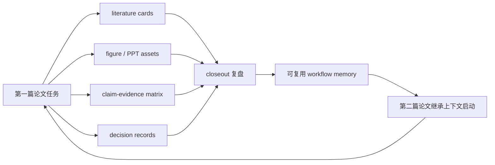

# Resevo

**把每一次科研任务，沉淀成下一篇论文可以复用的工作流。**

[English README](README.md)

正式入口是 `resevo`。历史 `researchloop` 命令和
`mcp/research_harness_mcp.py` 文件名暂时保留为 deprecated 兼容层。

Resevo 的四个产品边界是：

1. **Paper-to-paper workflow inheritance**：上一份论文的工作流经验成为下一份论文的起点；
2. **Claim-evidence-artifact provenance**：claim、evidence、artifact、command、run 和 decision 可追踪；
3. **Candidate-first, evidence-gated evolution**：自动写回只到 `candidate` / `pending validation`，晋升需要人工或证据门禁；
4. **Agent-agnostic CLI + MCP external brain**：Codex、Claude Code 调用本地 CLI/MCP，Resevo 不内置 Agent、LLM 或额外 API。

| 项目 | 主要对象 | Resevo 的差异 |
|---|---|---|
| OpenWiki | 项目知道什么 | Resevo 管理科研任务以后怎样做 |
| SimpleMem / MemRL / EvolveMem | 通用记忆和检索优化 | Resevo 演化带 claim-evidence-artifact 的科研 workflow |
| Open Science Desktop | 自动科研应用 | Resevo 是外部 Agent 的治理和记忆层 |
| Nature Skills | 科研 Agent starter skills | Resevo 可引用或接入 workflow，但不内置 Agent |
| Resevo | 证据治理科研 workflow harness | 本地 CLI + stdio MCP + candidate-first 演化 |

参考边界见 [`docs/architecture/reference-projects.md`](docs/architecture/reference-projects.md)，
目标架构见 [`docs/architecture/target-architecture.md`](docs/architecture/target-architecture.md)。

每个人的课题都不一样：有人做燃烧诊断，有人做材料表征，有人做结构仿真，有人做生信分析。所以 Resevo 不试图给你一套“开箱即用但很快失效”的万能科研流程。

Resevo 做的是另一件事：它帮助你在真实科研过程中，把自己的论文生产流程一步一步固定下来、验证起来、复用起来。

你今天做了一次文献调研，它可以沉淀成 literature intake。你今天做了一页组会 PPT，它可以沉淀成 figure / PPT asset。你今天确定了论文指标、baseline、实验边界，它可以沉淀成 claim-evidence matrix 和 decision record。你今天让 Codex 或 Claude Code 跑完一次科研任务，它可以在 closeout 阶段把有效经验写回为下一次可调用的 workflow memory。

Resevo 不是普通知识库，也不是又一个 AI agent。它是 Codex、Claude Code、Cursor 等外部 agent 的本地外置大脑：不替代 agent，不内置 LLM，不要求额外接入模型 API，只负责保存、检索、复盘、验证和迭代你的科研工作流。

## 核心思想

第一篇论文不是终点，而是你的科研工作流完成初始化的标志。

当你用 Resevo 跑完第一篇小论文时，你不仅得到了一篇 manuscript，还得到了一套属于你自己课题的可复用系统：你知道这个方向应该长期跟踪哪些领域和期刊；你知道文献应该如何读、如何卡片化、如何进入论文证据链；你知道 PPT 应该怎么做，哪些图能复用，哪些图只是临时展示；你知道每个 claim 需要哪些指标、baseline、残差、对比图和限制说明；你知道哪些 prompt、脚本、模板、图表风格和 decision 可以直接服务第二篇、第三篇论文。

Resevo 的目标不是让 AI 替你科研，而是让 AI 帮你把科研过程越跑越稳。

## 能力导航

[Paper Loop](workflows/paper_driven/paper_loop.md) · [Literature Loop](workflows/paper_driven/literature_intake.md) · [Figure Loop](workflows/paper_driven/figure_intake.md) · [Visual-To-Editable Loop](workflows/visual_to_editable/README.md) · [Evidence Loop](templates/research_project/03_claim_evidence_matrix.yaml) · [Closeout Loop](workflows/paper_driven/experiment_closeout.md) · [Self-Evolution Loop](workflows/self_evolution_loop/README.md)

| Loop | 固定什么 | 当前支撑 |
|---|---|---|
| Paper Loop | research brief、目标论文拆解、gap/contribution、manuscript storyboard、release pack | workflow、模板、最小示例、validator |
| Literature Loop | literature card、证据用途、引用位置、限制条件 | workflow、卡片模板、registry、placeholder 示例 |
| Figure Loop | visual reference、figure card、figure registry、版权/发布说明 | workflow、卡片模板、registry、内部示例 |
| Visual-To-Editable Loop | 图片、截图、PDF、图表、表格、流程图、公式图、UI 图路由到可编辑 PPT/SVG/HTML/Mermaid/Figma 风格资产 | router rules、CLI 校验、模板、脱敏示例 |
| Evidence Loop | claim-evidence matrix、数据/代码链接、baseline、limitation | 模板和 validator 支撑的最小示例 |
| Closeout Loop | reusable knowledge、prompt、asset、decision、registry 更新 | workflow 和 `closeout_check.py` |
| Self-Evolution Loop | recall、intake、候选写回、验证、下一瓶颈 | 本地 CLI 和测试；晋升仍需人工控制 |

## Resevo 适合谁？

- 正在做第一篇 SCI 小论文，但感觉文献、数据、PPT、代码、图表和 manuscript 很分散的研究生。
- 已经开始使用 Codex / Claude Code / Cursor 做科研，但缺少长期记忆、复盘和项目治理的人。
- 想把组会反馈、审稿意见、失败实验、好看的论文图和有效 prompt 沉淀为可复用资产的人。
- 希望从“每次重新开始”升级为“每篇论文都继承上一篇论文经验”的个人研究者。

## 它不是做什么？

- 不是适用于所有学科的万能 workflow。
- 不是自动写论文、替代导师、替代科研判断或替代审稿判断的系统。
- 不是内置 LLM 产品，也不是额外的模型 API 接入层。
- 不是原始实验数据、私密 trace、大图、模型权重、PDF 或投稿包的存储仓库。
- 不是把模板和规划功能包装成成熟生产功能。模板、示例、人工门禁会明确标注。

## 功能状态

| 功能 | 仓库证据 | 状态 |
|---|---|---|
| paper-driven workflow | [`workflows/paper_driven/paper_loop.md`](workflows/paper_driven/paper_loop.md)、[`templates/research_project/`](templates/research_project/)、[`examples/paper_lifecycle_minimal/`](examples/paper_lifecycle_minimal/) | 可用脚手架 |
| literature intake / literature card | [`workflows/paper_driven/literature_intake.md`](workflows/paper_driven/literature_intake.md)、[`templates/literature_card.md`](templates/literature_card.md)、[`registry/literature.yaml`](registry/literature.yaml) | 模板 + placeholder 示例 |
| figure intake / figure registry | [`workflows/paper_driven/figure_intake.md`](workflows/paper_driven/figure_intake.md)、[`templates/figure_card.md`](templates/figure_card.md)、[`registry/figures.yaml`](registry/figures.yaml)、[`visual_refs/`](visual_refs/) | 模板 + 内部示例 |
| visual-to-editable router | [`workflows/visual_to_editable/`](workflows/visual_to_editable/)、[`scripts/visual_to_editable_router.py`](scripts/visual_to_editable_router.py)、[`registry/visual_to_editable_skills.yaml`](registry/visual_to_editable_skills.yaml)、[`examples/visual_to_editable_minimal/`](examples/visual_to_editable_minimal/) | 规则 + 本地校验；外部工具只作为候选 |
| claim-evidence matrix | [`templates/research_project/03_claim_evidence_matrix.yaml`](templates/research_project/03_claim_evidence_matrix.yaml)、[`examples/paper_lifecycle_minimal/03_claim_evidence_matrix.yaml`](examples/paper_lifecycle_minimal/03_claim_evidence_matrix.yaml) | 模板 + 最小示例 |
| reviewer gate | [`workflows/paper_driven/reviewer_gate.md`](workflows/paper_driven/reviewer_gate.md) | 人工 checklist gate |
| task closeout | [`workflows/paper_driven/experiment_closeout.md`](workflows/paper_driven/experiment_closeout.md)、[`scripts/closeout_check.py`](scripts/closeout_check.py) | 可运行治理检查 |
| self-evolution loop | [`workflows/self_evolution_loop/README.md`](workflows/self_evolution_loop/README.md)、[`scripts/self_evolution_loop.py`](scripts/self_evolution_loop.py)、[`tests/test_self_evolution_loop.py`](tests/test_self_evolution_loop.py) | 可运行本地 CLI，candidate-first |
| reusable registries | [`registry/knowledge.yaml`](registry/knowledge.yaml)、[`registry/prompts.yaml`](registry/prompts.yaml)、[`registry/research_assets.yaml`](registry/research_assets.yaml)、[`registry/decisions.yaml`](registry/decisions.yaml) | YAML registry + validator |
| Codex / Claude Code 外置大脑定位 | [`AGENTS.md`](AGENTS.md)、[`CLAUDE.md`](CLAUDE.md)、[`mcp/README.md`](mcp/README.md) | 本地集成说明 |
| 发布安全边界 | [`.gitignore`](.gitignore)、[`harness.yaml`](harness.yaml)、closeout / registry validators | guardrail + 人工核查 |

## 初始工作流集成

Resevo 可以把优秀开源项目作为可选的初始工作流提供给用户，但不会把上游仓库直接 vendor 进本仓库。第一次 agent 对话时，应先检查 installer 状态，并在下载任何内容前询问用户。

| 上游项目 | 初始用途 | 本地路径 | 安装行为 | 状态 | License | Pinned ref |
|---|---|---|---|---|---|---|
| [Yuan1z0825/nature-skills](https://github.com/Yuan1z0825/nature-skills) | 文献搜索、论文阅读、写作、审稿模拟、引用核查、figure workflow、paper-to-PPT、返修回复等科研 agent 任务的可选初始 workflow seed | `external\nature-skills` | 先询问，用户同意后只 clone；不安装依赖，不写入全局 skill 目录 | optional starter，pending validation | Apache-2.0 | `8990143c3835f899e5331286a6a3b3393a2926ef` |

机器可读的来源是 [`registry/upstream_workflows.yaml`](registry/upstream_workflows.yaml)。README 按上游项目粒度列一行；每个 `nature-*` skill 的细节留在上游仓库或后续专门索引中。

## 从第一篇论文到第二篇论文



## 第一次使用路径

1. 把仓库放在稳定本地路径，例如 `D:\Resevo`。
2. 先读 [`AGENTS.md`](AGENTS.md)；如果使用 Claude Code，再读 [`CLAUDE.md`](CLAUDE.md)。
3. 第一次 agent 对话时，先检查可选 starter workflow 状态，并在下载 Nature Skills 前询问用户。
4. 用 [`templates/paper_contract.md`](templates/paper_contract.md) 或 [`templates/research_project/`](templates/research_project/) 开始一篇论文。
5. 把真实文献转成 [`templates/literature_card.md`](templates/literature_card.md)，并登记到 [`registry/literature.yaml`](registry/literature.yaml)。
6. 把有复用价值的视觉参考转成 [`templates/figure_card.md`](templates/figure_card.md)，并登记到 [`registry/figures.yaml`](registry/figures.yaml)。
7. 当图片、截图、PDF、图表、流程图或公式图需要变成可编辑资产时，用 [`scripts/visual_to_editable_router.py`](scripts/visual_to_editable_router.py) 分类，并保留重建 prompt、manifest、QA 和复现说明。
8. 用 [`templates/research_project/03_claim_evidence_matrix.yaml`](templates/research_project/03_claim_evidence_matrix.yaml) 绑定 claim、数据、代码、baseline 和 limitation。
9. 每次任务结束时按 [`workflows/paper_driven/experiment_closeout.md`](workflows/paper_driven/experiment_closeout.md) 做 closeout。
10. 发布或依赖 registry 状态前运行 validators。

## 常用命令

PowerShell 示例（将 `<Resevo路径>` 替换为本地 checkout）：

```powershell
Set-Location <Resevo路径>
python -m pip install -e .
resevo init
resevo doctor
resevo status
resevo recall --query "paper closeout reusable workflow" --project-root <项目路径>
resevo intake --project-root <项目路径> --trigger "closeout" --out <intake.yaml>
resevo closeout
resevo evaluate
resevo evolve propose
resevo mcp install codex --print
resevo mcp install claude --dry-run
resevo migrate researchloop --apply
```

可选的本地 MCP 只读入口：

```powershell
resevo mcp self-test
python mcp\research_harness_mcp.py --self-test
```

MCP 文件名保留历史 `research_harness` 标识是为了兼容；项目品牌名是 Resevo。

## 发布安全边界

只提交项目模板、脚本、文档、示例、registry schema/card、空白或脱敏示例文件。

不要提交：

- `.env`、API key、凭据、本地 token、个人路径快照；
- 原始数据、原始实验日志、私密 trace、`runs/`、`state/`；
- PDF、大图、slide export、最终论文图、manuscript package、submission package；
- 模型权重、checkpoint、二进制数组、大型输出、临时产物；
- `research_assets/` 中除小型 Markdown manifest 和 reproduction note 之外的二进制内容。

Resevo 可以通过明确的本地引用指向敏感或大型材料，但不应该把这些材料复制进仓库。

visual-to-editable 重建也遵守同一边界：源截图、PDF、私密实验图、最终投稿图、生成的 PPTX 和工具 trace 都留在仓库外；Resevo 只提交 prompt、manifest、QA 摘要、复现说明、registry 条目和脱敏文本示例。
