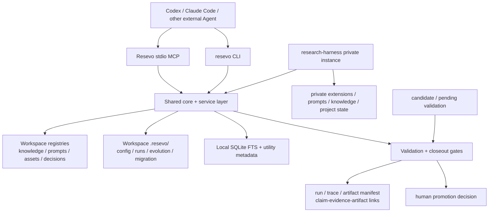

# Resevo Target Architecture



The public engine owns portable behavior, schemas, validators, CLI services,
MCP adapters, and sanitized examples. The private instance owns workspace
configuration, personal registries, knowledge, prompts, decisions, project
state, run records, and immature extensions. Compatibility wrappers remain at
the private boundary until each duplicated module has a replacement and a
passing regression test.

The dependency direction is one-way:

```text
Resevo public engine -> version-locked research-harness instance
research-harness real use -> sanitized candidate -> validation -> Resevo
```

No promotion path may infer `validated`, `reusable`, `approved`, `pass`, or
`paper_ready` from an ordinary MCP call or an automatic writeback.

