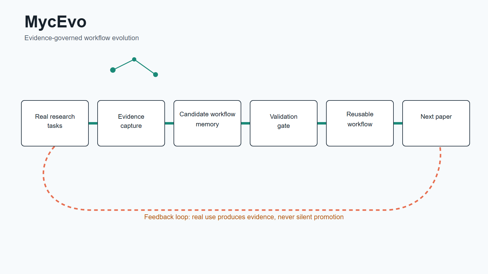
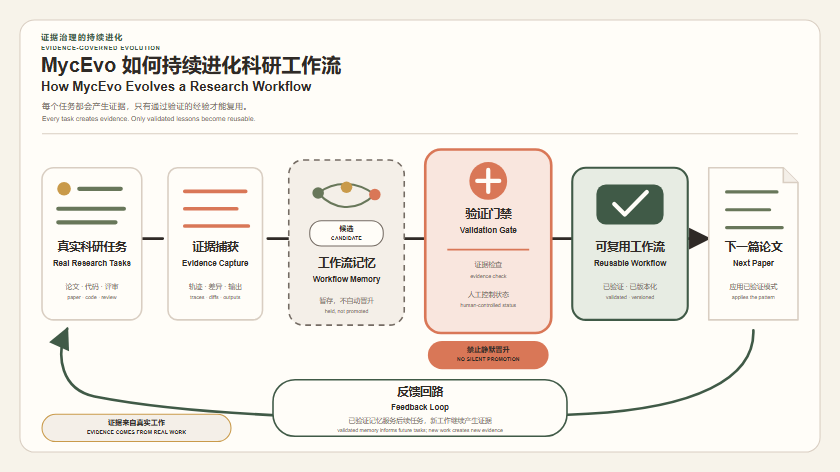
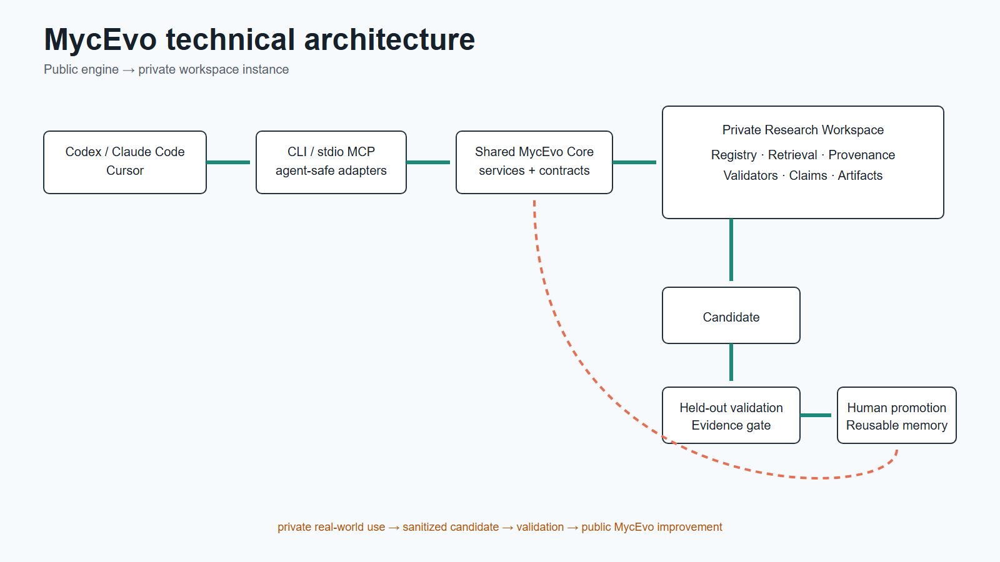
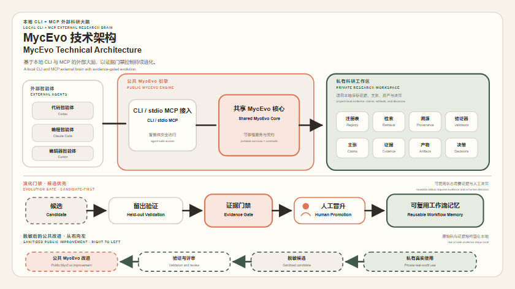
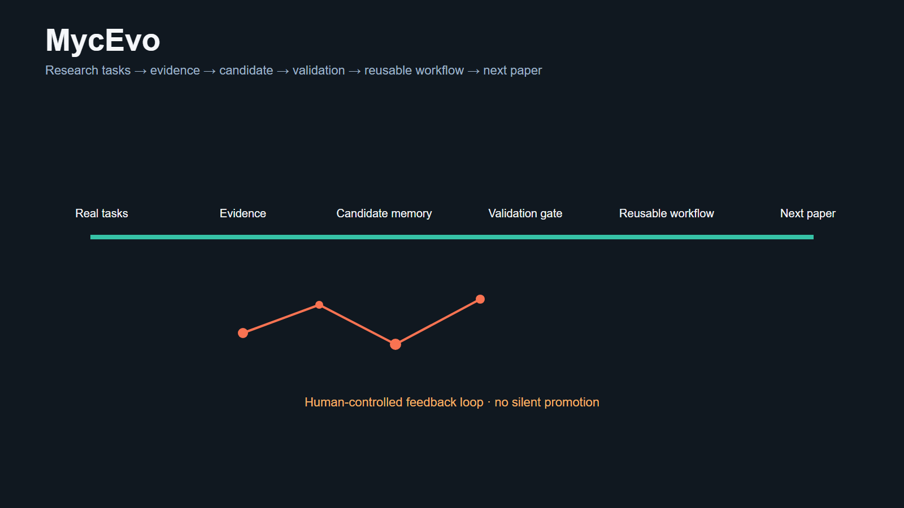
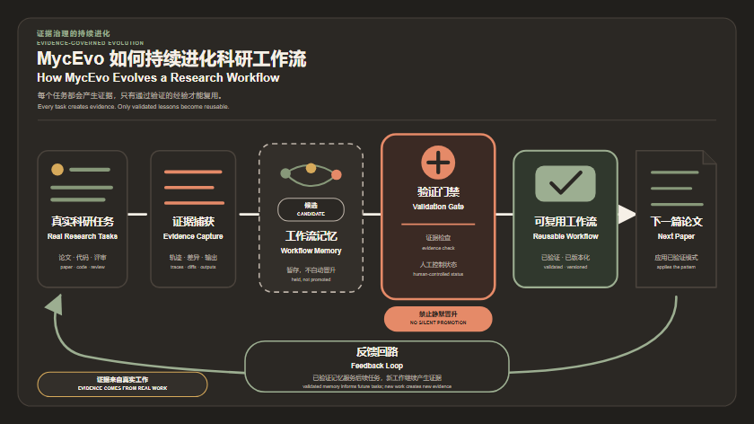
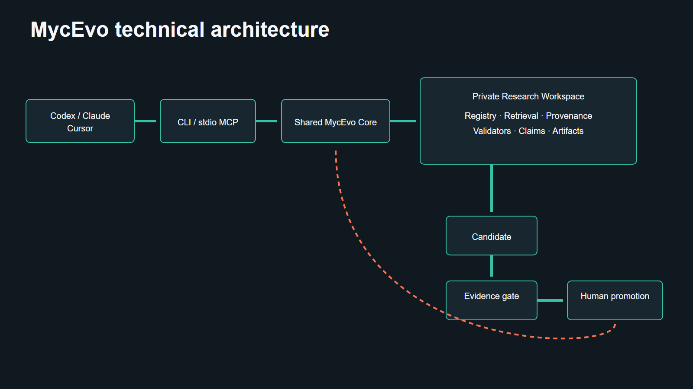
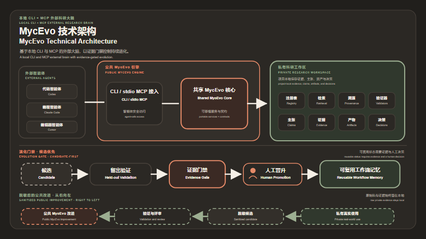

# MycEvo Diagram Visual QA

## Result

Status: pass for README use, with documented reduced-scale limits.

The four final files are native 1600×900 SVGs with editable bilingual text and vector primitives. Every visible label uses Simplified Chinese first and English second. Light and dark variants have identical labels, object structure, and relationships; only theme tokens change.

## Before and after

| Diagram | Before | After |
|---|---|---|
| Product, light |  |  |
| Technical, light |  |  |
| Product, dark |  |  |
| Technical, dark |  |  |

The old diagrams used repeated rectangles, lines without arrowheads, inconsistent light/dark semantics, incomplete technical modules, and—in the technical SVGs—transparent canvas regions. The new diagrams use full-canvas backgrounds, explicit directional markers, distinct candidate/gate/reusable states, and complete architecture boundaries.

## Design selection

OpenDesign produced three directions, preserved under `design/explorations/mycevo-diagrams/`. Product composition uses Organic Evidence Network plus Warm Editorial typography. Technical composition uses Structured Research System plus a restrained evidence-network grouping inside the private workspace. The weighted scoring and run IDs are recorded in the exploration README.

## Palette and typography

- Light: Warm Cream `#F7F3EA`, Paper White `#FFFDF8`, Terracotta `#D97757`, Deep Charcoal `#2F2A26`, Sage `#68775A`, Forest `#405A47`, Warm Border `#D9CEC2`, Muted `#746B63`, Soft Gold `#C99A4A`.
- Dark: Background `#211F1C`, Card `#2B2824`, Terracotta `#E58A68`, Sage `#879879`, Primary `#F6F0E7`, Muted `#BDB3A8`, Border `#4A433C`.
- Font stack: Inter, Arial, system UI, Noto Sans SC, Microsoft YaHei, PingFang SC, sans-serif. No remote font is required.

Measured contrast for key pairs:

| Pair | Ratio |
|---|---:|
| Light primary / paper | 13.96:1 |
| Light muted / paper | 5.13:1 |
| Light gate text / terracotta | 4.54:1 |
| Dark primary / card | 12.95:1 |
| Dark muted / card | 7.11:1 |
| Dark gate text / terracotta | 6.39:1 |

## Readability audit

Each SVG was rasterized at four sizes. Evidence is under `docs/design/previews/qa/<asset>/`:

- `100.png`: 1600×900 source size.
- `50.png`: 800×450.
- `25.png`: 400×225.
- `github.png`: 840×472 representative README width.

At 100%, 50%, and GitHub width, both language levels, stage labels, boundaries, and gate paths are clear. At 25%, Chinese primary labels and the main sequence, candidate/gate/reusable distinction, feedback loop, public/private boundary, and arrow directions remain understandable. English microcopy is intentionally secondary and is not reliably readable at 25%; the SVG text remains available when opened directly.

No reviewed render contains clipped headings, overlapping stage labels, text touching or crossing a card boundary, transparent canvas gaps, or line weights that disappear at 25%. Candidate memory, Validation Gate, Feedback Loop, workspace modules, and both lower pipelines were specifically enlarged or re-spaced for bilingual safe areas.

## Semantic audit

### Product mechanism

- Real research tasks produce evidence.
- Evidence enters candidate workflow memory first.
- Candidate and reusable states use different shape, border, and color treatments.
- Validation Gate is the dominant checkpoint.
- “No Silent Promotion” is explicit.
- Reusable Workflow feeds the Next Paper.
- The directional feedback curve returns from the next paper to real research tasks.

### Technical architecture

- Direction is External Agents → CLI/stdio MCP → Shared MycEvo Core → Private Research Workspace.
- Public MycEvo Engine and Private Research Workspace are separate labeled boundaries.
- The private workspace includes Registry, Retrieval, Provenance, Validators, Claims, Evidence, Artifacts, and Decisions.
- Evolution gate is Candidate → Held-out Validation → Evidence Gate → Human Promotion → Reusable Workflow Memory.
- The sanitized public-improvement path is intentionally right-to-left, matching the private-to-public spatial boundary, and labels that reading direction.
- “Raw private evidence stays local” prevents interpreting the dashed path as data upload.

## Structural checks

- XML parsing passed for all four SVGs.
- All files report `width="1600"`, `height="900"`, and `viewBox="0 0 1600 900"`.
- Each file has one `<title>`, one `<desc>`, `role="img"`, and `aria-labelledby`.
- Light/dark product files each contain 21 text nodes and 42 language spans; light/dark technical files each contain 35 text nodes and 70 language spans.
- Every visible `<text>` node contains exactly one Chinese and one English `<tspan>`; no unpaired visible text remains.
- No `<image>`, base64 content, external HTTP dependency beyond the SVG namespace, script, `foreignObject`, or remote CSS/font is present.
- File sizes remain small: roughly 9.3 KB for each product SVG and 12.3 KB for each technical SVG.

## Tool responsibilities

OpenDesign established three visual directions, ran source-level constraint checks, and provided self-contained HTML/inline-SVG exploration artifacts. Its desktop image export was unavailable in the installed daemon-only runtime, so previews were rendered from the completed artifacts with system Chrome.

Codex audited the rendered directions, scored them, rebuilt the selected hybrid as maintainable SVG, generated theme variants, measured contrast, rendered all QA scales, and performed the final semantic review.

## Known limitations

- English microcopy is not intended to be read at 400×225; Chinese primary labels and structural meaning are the 25% target.
- Proper names such as Codex, Claude Code, and Cursor are not translated; a Chinese role label is paired above each name instead.
- Exact glyph metrics vary slightly across operating systems because the files use installed system-font fallbacks.
- Repository-wide registry and closeout checks still report pre-existing references to the retired ResearchLoop root. The new visual asset entry uses only repository-relative paths and passes its focused manifest, case, path-existence, and uniqueness checks; the legacy migration debt is outside this visual-only branch.
